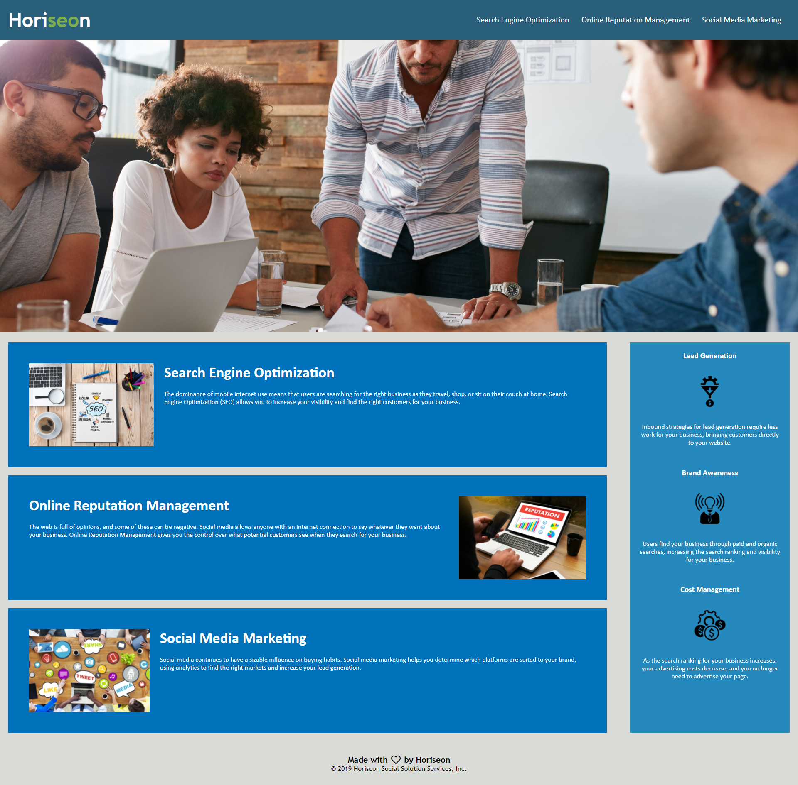

# Homework - Week 1 - Horiseon

## 01 HTML, CSS, and Git: Code Refactor - Steve Barry

##  The Task

The task for this week was to review a some code, refactor and optimise it, while retaining the same UI presented to the user.

### ⭐ ⭐ S.T.A.R. ⭐ ⭐

**SITUATION**

The provided user story was: 

> AS A marketing agency
> 
> I WANT a codebase that follows accessibility standards
>
> SO THAT our own site is optimized for search engines

**TASK**

The work required is to improve the code, without changing its functionality, so that it is less verbose, optimised, and meets modern assessibility standards.

**ACTION**

A full review of the code, resulting in:
* HTML
  * *Fixing internal links*
  * *Semantic elements*
  * *Tidy code*
  * *Improved visualisation - eg: indentation*
  *  *Error free loading*
* CSS
  * *Grouping together of individual classes with identical styling*
  * *Accessibility for Background Image on the banner added (screen reader)*
  * *Increased contrast on Horiseon title*
  * *Alternative text added for all images*
  * *Correct attributes added*
  * *Removal of duplication of code*
  * *Comments added*
* IMAGES
  * *Favicon designed and added*
* GIT
  * *Numerous commits to track changes in code*
  * *Code added to public repository and Github Pages for public viewing*

**RESULT**

The end code is stored on Github, and publicly available and viewable. Accessibility functionality has been added, links have been fixed, code has been optimised, and the UI exceeds 90% similarity. This result meets all requirements of the User Story and acceptance criteria:

* ~~GIVEN a webpage meets accessibility standards~~
* ~~WHEN I view the source code~~
* ~~THEN I find semantic HTML elements~~
* ~~WHEN I view the structure of the HTML elements~~
* ~~THEN I find that the elements follow a logical structure independent of styling and positioning~~
* ~~WHEN I view the icon and image elements~~
* ~~THEN I find accessible alt attributes~~
* ~~WHEN I view the heading attributes~~
* ~~THEN they fall in sequential order~~
* ~~WHEN I view the title element~~
* ~~THEN I find a concise, descriptive title~~

##  The Outcome

As the acceptance criteria has been met, the task is now complete.

You can view the finished product [HERE](https://nbs5000.github.io/hw-wk1_Horiseon/)

Alternatively, here is a screenshot:

> 

---

Written by Steve Barry - Due date 2/12/2021

© 2021 Trilogy Education Services, LLC, a 2U, Inc. brand. Confidential and Proprietary. All Rights Reserved.

